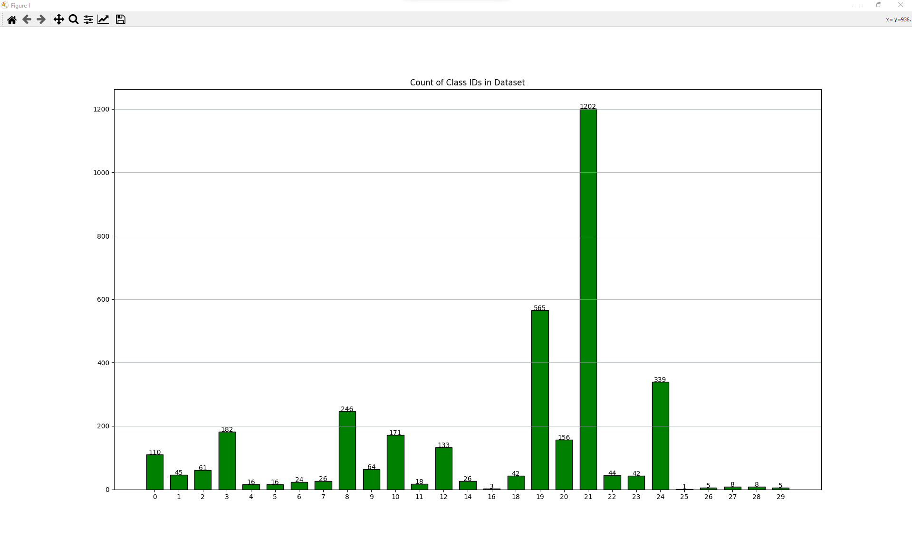
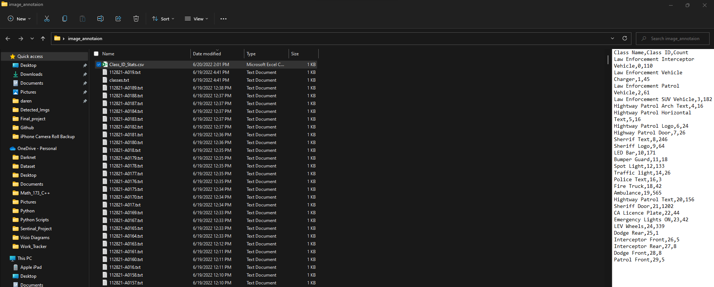
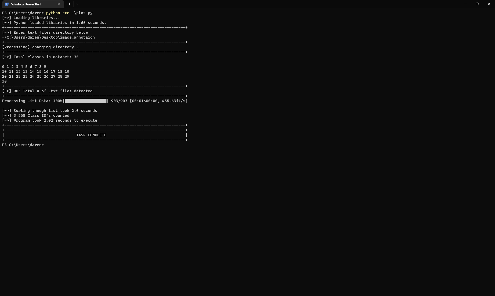

# yolo_class_plotter
Yolo Class ID Plotter lets you see how many IDs are in each class. 

## -Getting Started-

In order to get started you’ll need to have numpy, matplotlib, and tqdm installed. Make sure that you have your labeled dataset in its own folder and have the classes.txt file in there as well. Open terminal, cmd PowerShell and run the script.

Copy your dataset path and paste it when asked.

Once path is entered, yolo_class_plotter will read your classes.txt file and count total classes in the file. Yolo_class_plotter will start counting every class id in the text files and will plot them in a graph. You can choose to save the graph that matplotlib generates but does save on it own.

Once the program has finished it will create a csv file and save it to your dataset folder as Class_ID_Stats.csv.

Once the program is done it will let you know that the task is complete.

## -Purpose-

The purpose is to visually see how many class ids you have per class and give insight on your yolo model.

